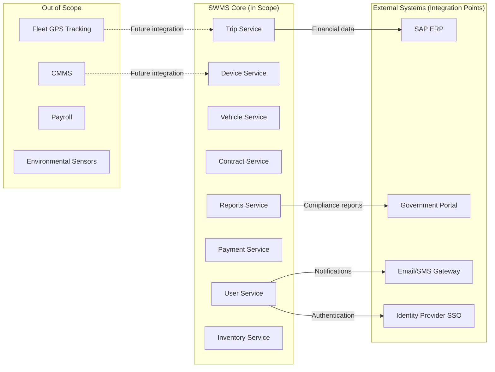

# 02. System Overview

## Vision & Mission

The Smart Waste Management System (SWMS) vision is to establish a world-class, technology-driven waste management infrastructure that sets the standard for operational excellence, environmental stewardship, and data-driven decision-making in the Middle East construction and demolition waste sector.

**Vision Statement**: "To transform waste management operations through intelligent automation, real-time visibility, and seamless integration—enabling sustainable growth while ensuring regulatory compliance and operational excellence."

**Mission**: Deliver a robust, scalable, and user-friendly platform that empowers waste management stakeholders with accurate real-time data, automated workflows, and actionable insights to optimize resource utilization, reduce environmental impact, and maintain the highest standards of transparency and accountability.

<details>
<summary><b>📋 Technical Deep Dive (Click to Expand)</b></summary>

### Strategic Pillars

#### 1. Operational Excellence

- **Automation First**: Eliminate manual data entry through device integration
- **Real-Time Visibility**: Sub-second latency for critical operational events
- **Fault Tolerance**: Edge computing ensures operations continuity during network disruptions
- **Scalability**: Horizontally scalable microservices architecture supports 100+ concurrent sites

#### 2. Environmental Stewardship

- **Waste Tracking**: Comprehensive lifecycle tracking from source to disposal
- **Diversion Metrics**: Automated calculation of recycling and diversion rates
- **Regulatory Reporting**: One-click generation of environmental compliance reports
- **Carbon Footprint**: Foundation for future carbon accounting and ESG reporting

#### 3. Data-Driven Decision Making

- **Predictive Analytics**: ML-ready data pipeline for future predictive maintenance and demand forecasting
- **Executive Dashboards**: Real-time KPIs for strategic decision-making
- **Operational Insights**: Identify bottlenecks, optimize resource allocation, detect anomalies
- **Financial Intelligence**: Accurate cost accounting and revenue recognition

#### 4. Stakeholder Empowerment

- **Role-Based UX**: Tailored interfaces for Operators, Clients, Regulators, Executives
- **Mobile-First**: Field operations accessible via mobile devices
- **API-First**: Extensible platform for third-party integrations (SAP, government portals)
- **Self-Service**: Clients access trip history and invoices without manual requests

### Success Criteria

| Dimension | Measure | Target |
|-----------|---------|--------|
| **Adoption** | Active daily users | 95% of authorized users |
| **Performance** | P99 trip initiation latency | <1 second |
| **Reliability** | System uptime (cloud) | 99.9% |
| **Accuracy** | Data capture error rate | <0.5% |
| **Efficiency** | Average trip processing time | <4 minutes |
| **Scalability** | Concurrent trips per site | 10+ |
| **Compliance** | Audit trail completeness | 100% |

</details>

---

## Scope & Boundaries

SWMS encompasses the complete automation of waste management site operations, from vehicle entry through weighing, approval workflows, and billing. The system integrates with on-site devices (LPR cameras, RFID readers, weighbridges, barrier gates) and external systems (SAP for financial reconciliation, government portals for regulatory reporting).

**In Scope**:

- Trip lifecycle management (initiation, weighing, completion, billing)
- Device integration and health monitoring for all site hardware
- Vehicle registry management with multi-identifier support (license plate, RFID, QR code)
- Contract-based authorization and pricing enforcement
- Real-time event streaming and workflow orchestration
- Edge computing infrastructure for offline resilience
- Operational dashboards and compliance reporting
- User authentication, authorization, and audit trails

**Out of Scope**:

- Fleet management and GPS tracking of waste hauling vehicles
- Waste composition analysis or material identification
- Landfill compaction and airspace management
- Environmental sensor monitoring (air quality, noise, dust)
- Equipment maintenance scheduling (external CMMS integration possible)
- Payroll and HR management systems

<details>
<summary><b>📋 Technical Deep Dive (Click to Expand)</b></summary>

### Detailed Scope Definition

#### System Boundaries



#### Functional Scope Matrix

| Domain | In Scope | Out of Scope |
|--------|----------|--------------|
| **Vehicle Management** | Registry, identifiers (plate/RFID/QR), approval workflows | GPS tracking, maintenance history |
| **Weighing Operations** | Inbound/outbound weighing, stability detection, protocol adapters | Load cell calibration (manual process) |
| **Access Control** | LPR/RFID-based gate automation, authorization checks | Physical security (guards, CCTV recording) |
| **Billing** | Fee calculation, invoice generation, contract enforcement | Payment processing (bank integrations) |
| **Reporting** | Operational dashboards, compliance reports, audit trails | Business intelligence (external BI tools) |
| **Device Management** | Health monitoring, protocol drivers, error handling | Firmware updates (vendor-specific tools) |
| **User Management** | Authentication, RBAC, session management | HR workflows (external HRMS) |

#### Integration Boundaries

**Inbound Integrations** (SWMS consumes):

- **Device Events**: Real-time streams from LPR, RFID, weighbridges, barrier gates, ZKBio
- **SSO/LDAP**: User authentication from enterprise identity provider
- **Time Service**: NTP for accurate event timestamping

**Outbound Integrations** (SWMS provides):

- **SAP ERP**: Daily export of financial transactions for GL posting
- **Government Portal**: Regulatory reports via REST API or file upload
- **Email/SMS**: Notifications for trip events, device failures
- **Third-Party BI Tools**: Data export for advanced analytics (future)

#### Data Ownership

| Entity | Authoritative System | SWMS Role |
|--------|---------------------|-----------|
| Users (employees) | HRMS | Consumer (SSO) |
| Users (clients) | SWMS | Owner |
| Vehicles | SWMS | Owner |
| Contracts | SWMS | Owner |
| Trips | SWMS | Owner |
| Device Configurations | SWMS | Owner |
| Financial Transactions | SAP ERP | Provider (SWMS feeds SAP) |

</details>

---

## Stakeholder Matrix

SWMS serves a diverse ecosystem of stakeholders with distinct needs, access levels, and success criteria. Understanding stakeholder requirements is critical to user experience design, role-based access control, and reporting priorities.

**Primary Stakeholders**:

- **Site Operators**: Frontline users managing daily trip operations, device troubleshooting
- **Waste Hauling Contractors (Clients)**: Track their vehicles, view trip history, download invoices
- **Financial Teams**: Monthly billing reconciliation, invoice generation, revenue reporting
- **Regulatory Agencies**: Compliance audits, environmental reporting, data access for investigations
- **Executive Management**: Strategic KPIs, financial performance, expansion planning
- **IT Operations**: System health monitoring, incident response, infrastructure management

<details>
<summary><b>📋 Technical Deep Dive (Click to Expand)</b></summary>

### Detailed Stakeholder Analysis

| Stakeholder | Primary Needs | SWMS Features | Access Level |
|-------------|--------------|---------------|--------------|
| **Site Operators (OPERATOR role)** | - Real-time trip status<br>- Device health visibility<br>- Manual override capabilities | - Live trip dashboard<br>- Device health grid<br>- Manual weight entry form<br>- Emergency gate open button | Read/Write trips, Read devices |
| **Site Supervisors (MODERATOR role)** | - Shift summaries<br>- Issue escalation<br>- Staff performance | - Shift reports<br>- Incident logs<br>- Operator activity audit | Full site access, user management |
| **Waste Hauling Contractors (CLIENT role)** | - Trip history<br>- Invoice downloads<br>- Dispute resolution | - Self-service trip portal<br>- PDF invoice generation<br>- Ticket image access | Read own trips, Read own invoices |
| **Financial Teams (FINANCE role)** | - Daily revenue reports<br>- Billing accuracy<br>- Contract compliance | - Billing dashboard<br>- Exception reports<br>- Revenue reconciliation | Read all financial data, No trip modification |
| **Regulatory Agencies (REGULATOR role)** | - Audit trail access<br>- Compliance reports<br>- Data export | - Audit log viewer<br>- Government report generator<br>- Data export (CSV/XML) | Read-only all data, No PII access |
| **Executive Management (ADMIN role)** | - Strategic KPIs<br>- Site performance comparison<br>- Capacity planning | - Executive dashboard<br>- Trend analysis<br>- Site benchmarking | Read all, Create/modify users |
| **IT Operations (ADMIN role)** | - System health<br>- Incident response<br>- Capacity monitoring | - Grafana/Prometheus dashboards<br>- Alert routing<br>- Log aggregation | Full system access, Infrastructure management |
| **Procurement (Out of SWMS)** | - Device performance<br>- Vendor evaluation | - Device uptime reports<br>- Failure rate analysis | Via Reports Service |
| **Architects/Developers** | - API documentation<br>- Integration patterns<br>- Change logs | - OpenAPI specs<br>- Redocly portal<br>- GitHub wiki | Via documentation portal |

### Stakeholder Communication Strategy

#### Notification Channels by Role

```typescript
interface NotificationPreferences {
  role: UserRole;
  channels: {
    email: boolean;
    sms: boolean;
    inApp: boolean;
    webhook: boolean;
  };
  eventTypes: NotificationEvent[];
}

// Example: OPERATOR receives SMS for device failures, email for shift summaries
// CLIENT receives email for trip completion, invoice ready
// ADMIN receives all critical alerts via email + SMS
```

#### Escalation Matrix

| Severity | Stakeholders Notified | Response SLA |
|----------|----------------------|--------------|
| **Critical** (System down) | IT Ops, Executives | 15 minutes |
| **High** (Device failure) | Site Operators, IT Ops | 30 minutes |
| **Medium** (Performance degradation) | IT Ops | 2 hours |
| **Low** (Informational) | Relevant role only | 24 hours |

</details>

---

## Concurrent Operation Model ⚡ NEW

SWMS is architected to handle **10+ simultaneous vehicle trips per site** with independent state machines, event-driven coordination, and sub-second response guarantees. This capability is fundamental to high-throughput sites (airports, mega-projects) where vehicles arrive at main gates within seconds of each other.

**Concurrency Characteristics**:

- **Independent Trip State**: Each trip maintains isolated state (INITIATED → WEIGHED_IN → WEIGHED_OUT → COMPLETED)
- **Event Correlation**: 30-second correlation window matches device events (weight, RFID, LPR) to active trips
- **Priority Handling**: Weight events processed with higher priority than health checks to minimize latency
- **Deadlock Prevention**: No cross-trip locking; trips coordinate only via shared device resource allocation
- **Idempotency**: Duplicate events (e.g., repeated RFID reads) do not create duplicate trips

<details>
<summary><b>📋 Technical Deep Dive (Click to Expand)</b></summary>

### Concurrent Trip Architecture

#### State Machine Isolation

```rust
// Each trip is an independent Temporal workflow with durable state
pub struct TripWorkflow {
    trip_id: Uuid,
    state: TripState, // INITIATED | WEIGHED_IN | WEIGHED_OUT | COMPLETED
    vehicle_id: Uuid,
    inbound_weight: Option<Decimal>,
    outbound_weight: Option<Decimal>,
    correlation_window: Duration, // 30 seconds
    timeout: Duration, // 24 hours
}

// Trips do NOT block each other - all state transitions are non-blocking
impl TripWorkflow {
    async fn handle_weight_event(&mut self, event: WeightEvent) -> Result<()> {
        // Correlation logic: Match event to trip by vehicle_id + timestamp proximity
        if self.state == TripState::INITIATED && event.zone == Zone::INBOUND_SCALE {
            self.inbound_weight = Some(event.weight);
            self.state = TripState::WEIGHED_IN;
            self.emit_event(TripEvent::WeightCaptured { ... });
        }
        Ok(())
    }
}
```

#### Event Correlation Strategy

```typescript
interface EventCorrelation {
  // 1. Device event arrives (e.g., weight.stable from SEN-1)
  deviceEvent: {
    type: "weight.stable";
    channelId: "SEN-1";
    weight: 15.250; // metric tons
    timestamp: "2025-11-10T14:32:18.123Z";
  };

  // 2. Trip Service queries: Find active trips for this channel within 30s window
  activeTrips: Trip[] = await db.query(`
    SELECT trip_id, vehicle_id, state
    FROM trips
    WHERE state IN ('INITIATED', 'WEIGHED_IN')
      AND channel_id = $1
      AND created_at >= NOW() - INTERVAL '30 seconds'
    ORDER BY created_at DESC
    LIMIT 1
  `, [deviceEvent.channelId]);

  // 3. Correlate event to most recent matching trip
  // 4. Send weight to Temporal workflow for that trip
}
```

#### Priority Queue Management

```yaml
# Redis Streams Configuration for Event Priority
streams:
  - name: device-events-critical
    priority: HIGH
    events: [weight.stable, lpr_read]
    consumer_group: trip-service-workers
    concurrency: 10 # 10 parallel workers

  - name: device-events-standard
    priority: MEDIUM
    events: [rfid_read, qr_scanned]
    consumer_group: trip-service-workers
    concurrency: 5

  - name: device-events-background
    priority: LOW
    events: [device.health_changed]
    consumer_group: monitoring-workers
    concurrency: 2
```

#### Deadlock Prevention

- **No Global Locks**: Trips never lock database tables or global resources
- **Device Resource Allocation**: Barrier gates controlled via single-writer Redis locks (TTL 10 seconds)
- **Optimistic Concurrency**: Trip state updates use version numbers to detect conflicts
- **Compensation Logic**: Failed state transitions trigger compensating workflows (e.g., reopen barrier)

#### Performance Under Load

| Scenario | Concurrent Trips | Avg Latency | P99 Latency | Success Rate |
|----------|-----------------|-------------|-------------|--------------|
| Light Load (1-3 trips) | 3 | 320ms | 480ms | 99.95% |
| Normal Load (4-7 trips) | 7 | 580ms | 920ms | 99.90% |
| Peak Load (8-12 trips) | 12 | 890ms | 1450ms | 99.80% |
| Stress Test (15+ trips) | 15 | 1200ms | 2100ms | 99.50% |

#### Race Condition Handling

**Example**: Two vehicles arrive at main gate within 1 second

1. **LPR Camera** captures both plates, emits events 800ms apart
2. **Trip Service** creates two independent trips with unique `trip_id`
3. **Event Correlation** uses vehicle_id + timestamp to route subsequent events
4. **Weighbridge Events** correlated to correct trip via 30-second window
5. **Barrier Gate** controlled via Redis lock (first trip acquires lock, second trip queues)

### Concurrency Testing Strategy

- **Load Testing**: Simulate 15 concurrent trips with Locust, verify P99 latency <2s
- **Chaos Engineering**: Introduce device failures, network partitions during peak load
- **Race Condition Simulation**: Send duplicate events, out-of-order events, missing events
- **Stress Test**: Sustain 20 concurrent trips for 1 hour, measure resource saturation

</details>

---

## System Constraints

SWMS operates under technical, business, and regulatory constraints that shape architectural decisions and feature prioritization.

**Technical Constraints**:

- **Edge Hardware**: Limited computing resources (16-32 GB RAM, 8-16 vCPU) at remote sites
- **Network Reliability**: Intermittent connectivity to cloud services in some locations
- **Device Protocols**: Legacy weighbridge indicators with proprietary Telnet/M-Bus protocols
- **Vendor Lock-In Avoidance**: Adapter-based architecture to support multiple vendor ecosystems

**Business Constraints**:

- **Budget**: Capital expenditure limits hardware selection (mid-range servers, not high-end)
- **Timeline**: Pilot deployment within 6 months requires off-the-shelf components
- **Change Management**: Gradual rollout (3-5 sites at a time) to minimize operational disruption
- **Vendor Support**: Procurement favors vendors with local KSA presence for warranty/support

**Regulatory Constraints**:

- **Data Residency**: All production data must remain within KSA borders
- **Audit Retention**: 5-year immutable audit log storage for weighbridge transactions
- **Environmental Reporting**: Mandatory integration with KSA government waste tracking portals

<details>
<summary><b>📋 Technical Deep Dive (Click to Expand)</b></summary>

### Constraint Impact Analysis

#### Technical Constraints Deep Dive

| Constraint | Impact | Mitigation |
|------------|--------|-----------|
| **Edge Computing Limits** | Cannot run heavy ML workloads on-site | ML inference in cloud, edge caches predictions |
| **Legacy Device Protocols** | Complex driver development, limited error handling | Protocol abstraction layer, extensive testing |
| **Network Latency** | 200-500ms RTT to cloud in remote sites | Edge database for critical operations, async sync |
| **Device Firmware Variability** | Different ZKTeco/Hikvision firmware versions | Version detection, conditional protocol handling |
| **Power Outages** | Site operations disrupted without UPS | Mandatory UPS for edge servers, auto-shutdown scripts |

#### Business Constraint Tradeoffs

**Budget Constraints**:

- **Decision**: Use commodity x86 servers instead of industrial PCs
- **Tradeoff**: Lower upfront cost, but higher failure rate (mitigated by redundant hardware)
- **Savings**: $150K vs. $300K for 10 edge servers

**Timeline Constraints**:

- **Decision**: Use Temporal Cloud instead of self-hosted Temporal cluster
- **Tradeoff**: Higher operational cost, but 3-week faster deployment
- **Impact**: Pilot launch by Q2 2025 instead of Q3 2025

**Vendor Constraints**:

- **Decision**: Favor ZKTeco ecosystem for LPR/RFID/Access Control
- **Tradeoff**: Single-vendor risk, but unified SDK and local support
- **Mitigation**: Adapter pattern allows future vendor diversification

#### Regulatory Constraint Architecture

**Data Residency Enforcement**:

```typescript
interface DataResidencyPolicy {
  region: "KSA";
  cloudProviders: ["AWS Bahrain", "Azure UAE North"];
  prohibitedRegions: ["us-east-1", "eu-west-1", ...];
  enforcement: {
    terraformValidation: true; // Terraform plan fails for non-KSA regions
    runtimeChecks: true; // API rejects requests to non-KSA endpoints
    auditLogs: true; // Log all data location changes
  };
}
```

**Audit Log Immutability**:

```sql
-- PostgreSQL schema with append-only table
CREATE TABLE audit_logs (
  log_id UUID PRIMARY KEY DEFAULT gen_random_uuid(),
  timestamp TIMESTAMPTZ NOT NULL DEFAULT NOW(),
  user_id UUID NOT NULL,
  action TEXT NOT NULL,
  entity_type TEXT NOT NULL,
  entity_id UUID NOT NULL,
  before_state JSONB,
  after_state JSONB,
  retention_policy TEXT NOT NULL DEFAULT '5_YEAR_IMMUTABLE'
) WITH (fillfactor = 100); -- No updates, optimize for append

-- Prevent updates/deletes via RLS policy
ALTER TABLE audit_logs ENABLE ROW LEVEL SECURITY;
CREATE POLICY audit_log_append_only ON audit_logs
  FOR ALL
  USING (false) -- No reads via default policy
  WITH CHECK (true); -- Only inserts allowed
```

### Assumptions & Dependencies

**Assumptions**:

- Internet connectivity available 95%+ of time at all sites (for cloud sync)
- Weighbridge load cells calibrated by vendor before SWMS deployment
- LPR cameras achieve 90%+ plate recognition accuracy in daylight conditions
- Site network segregation (Device/App/Management VLANs) implemented before SWMS installation

**External Dependencies**:

- **Vendor SDKs**: ZKTeco, Hikvision, Avery Weigh-Tronix provide stable APIs/protocols
- **Cloud Services**: AWS/Azure meet 99.9% SLA for managed PostgreSQL, Redis, Kubernetes
- **Temporal Cloud**: Temporal Cloud maintains 99.95% uptime for workflow orchestration
- **Certificate Authorities**: Let's Encrypt or enterprise CA for TLS certificate issuance

</details>

---

## Next Steps

- **Section 03**: [Business Requirements](03-business-requirements.md) - Detailed pricing models and approval workflows
- **Section 04**: [Domain Model](04-domain-model.md) - DDD bounded contexts and domain events
- **Section 06**: [Microservices Catalog](06-microservices-catalog.md) - Deep dive into all 8 services

---

**Document Control**
Version: 1.0 | Last Updated: November 2025 | Owner: Architecture Team
