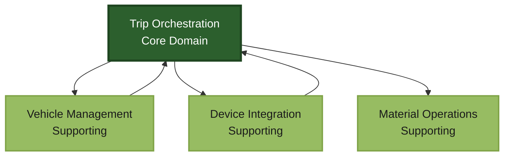
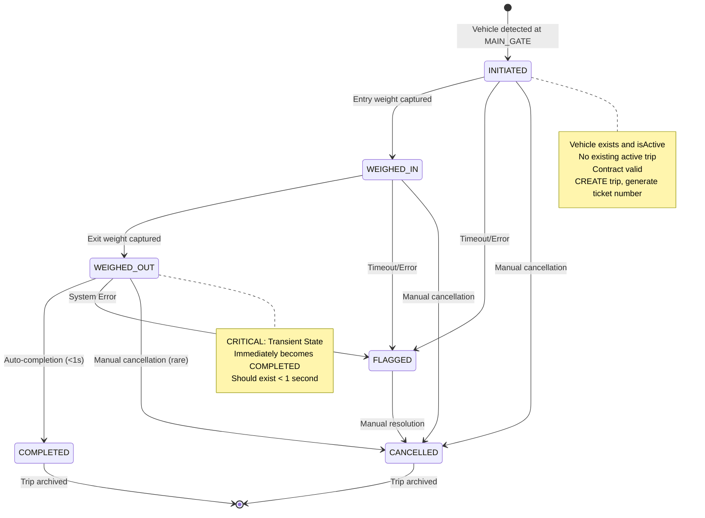

# Section 04: Domain Model

<div class="intro-banner">
<i class="fas fa-sitemap"></i>
<h2>Domain Model & Business Logic Architecture</h2>
<p>Complete bounded context mapping, entity relationships, value objects, domain services, and ubiquitous language for the Smart Waste Management System</p>
</div>

## 4.1 Bounded Context Overview

The SWMS domain is organized around **Event-Driven Trip Orchestration** as the central bounded context, with supporting contexts for vehicle management, device integration, and reporting.

### Core Bounded Contexts

<div class="diagram-controls">
  <button onclick="zoomIn('context-diagram')"><i class="fas fa-search-plus"></i></button>
  <button onclick="zoomOut('context-diagram')"><i class="fas fa-search-minus"></i></button>
  <button onclick="resetZoom('context-diagram')"><i class="fas fa-home"></i></button>
</div>

<div class="panzoom-container" id="context-diagram">



</div>

**Primary Bounded Context**: Trip Orchestration manages the complete vehicle journey lifecycle from gate entry through waste disposal to exit, coordinating all device events and state transitions.

**Supporting Contexts**: Vehicle Management handles registration and validation, Device Integration normalizes hardware events, Material Operations manages inventory and sales.

<div class="alert alert-info">
<strong><i class="fas fa-info-circle"></i> Architecture Note:</strong> The Trip Orchestration context is the core domain that orchestrates all business logic. All other contexts are supporting and feed data into or receive commands from this central domain.
</div>

## 4.2 Core Domain Entities

<details>
<summary><strong><i class="fas fa-database"></i> Trip Aggregate Root - Complete Entity Structure</strong></summary>

### Trip Aggregate Root

**Trip** is the primary aggregate root managing the complete vehicle journey state machine.

```typescript
interface Trip {
  // Identity
  id: string;
  ticketNumber: string; // Format: SWMS-2025-XXXXXX

  // Associations
  vehicleId: string;
  contractId: string;
  userId?: string;

  // State Management
  status: TripStatus;

  // Journey Tracking
  entryTime: Date;
  entryZone: ZoneId; // MEG_1, MEG_2, MEG_3

  // Weight Capture
  entryWeight?: number; // kilograms
  entryWeightTime?: Date;
  entryWeightZone?: ZoneId; // SEN_1, SEN_2, SEN_3

  exitWeight?: number; // kilograms
  exitWeightTime?: Date;
  exitWeightZone?: ZoneId; // SIT_1, SIT_2, SIT_3

  // Calculated Values
  netWeight?: number; // entryWeight - exitWeight

  // Lifecycle
  completedAt?: Date;
  createdAt: Date;
  updatedAt: Date;
}
```

</details>

<details>
<summary><strong><i class="fas fa-truck"></i> Vehicle Entity - Registration & Tracking</strong></summary>

**Vehicle** manages individual vehicle registration, validation, and QR code generation.

```typescript
interface Vehicle {
  id: string;
  plateNumber: string; // Value object with validation
  contractId: string;
  userId?: string;
  isActive: boolean;
  vehicleType: string;
  emptyWeight: number; // kilograms
  rfidTagNumber?: string;
  qrCode: string; // Generated on registration
}
```

<div class="alert alert-success">
<strong><i class="fas fa-check-circle"></i> Registration Methods:</strong> Vehicles support both manual single registration and automated bulk CSV/Excel upload processing via <code>/api/vehicles/bulk</code> endpoint.
</div>

</details>

<details>
<summary><strong><i class="fas fa-file-contract"></i> Contract Entity - Vehicle Container</strong></summary>

### Trip State Machine

**Trip Status Enumeration:**

```typescript
enum TripStatus {
  INITIATED = 'INITIATED',     // Vehicle detected at main gate
  WEIGHED_IN = 'WEIGHED_IN',   // Entry weight captured
  WEIGHED_OUT = 'WEIGHED_OUT', // Exit weight captured (transient)
  COMPLETED = 'COMPLETED',     // Journey completed successfully
  FLAGGED = 'FLAGGED',         // Requires manual investigation
  CANCELLED = 'CANCELLED'      // Manual cancellation
}
```

**State Transitions:**

<div class="diagram-controls">
  <button onclick="zoomIn('state-machine')"><i class="fas fa-search-plus"></i></button>
  <button onclick="zoomOut('state-machine')"><i class="fas fa-search-minus"></i></button>
  <button onclick="resetZoom('state-machine')"><i class="fas fa-home"></i></button>
</div>

<div class="panzoom-container" id="state-machine">



</div>

### Vehicle Entity

```typescript
interface Vehicle {
  id: string;
  plateNumber: string; // Value object with validation
  contractId: string;
  userId?: string;
  isActive: boolean;
  vehicleType: string;
  emptyWeight: number; // kilograms
  rfidTagNumber?: string;
  qrCode: string; // Generated on registration
}
```

### Contract Entity

**Contract** serves as a container for vehicle registration with limits, not business agreements.

```typescript
interface Contract {
  id: string;
  registrationNumber: string;
  isActive: boolean;
  vehicleLimit: number;
  createdAt: Date;
  updatedAt: Date;
}
```

<div class="alert alert-warning">
<strong><i class="fas fa-exclamation-triangle"></i> Important:</strong> Contract is just a container for vehicle registration - no business agreements or terms. Only sets vehicle limits per contract.
</div>

</details>

## 4.3 Value Objects and Domain Primitives

<details>
<summary><strong><i class="fas fa-id-card"></i> PlateNumber Value Object - Saudi Validation</strong></summary>

```typescript
class PlateNumber {
  private constructor(private readonly value: string) {}

  static create(plateNumber: string): PlateNumber {
    if (!this.isValid(plateNumber)) {
      throw new Error('Invalid plate number format');
    }
    return new PlateNumber(plateNumber);
  }

  private static isValid(plateNumber: string): boolean {
    // Saudi plate number validation logic
    return /^[0-9]{1,4}-[A-Z]{3}$/.test(plateNumber);
  }

  toString(): string {
    return this.value;
  }
}
```

</details>

<details>
<summary><strong><i class="fas fa-map-marker-alt"></i> Zone Identifiers & Device Events</strong></summary>

**Zone Type Mapping:**

```typescript
type ZoneId = 'MEG_1' | 'MEG_2' | 'MEG_3' |  // Main Gate Entry
              'SEN_1' | 'SEN_2' | 'SEN_3' |  // Scale Entry (Inbound)
              'SIT_1' | 'SIT_2' | 'SIT_3';   // Scale Exit (Outbound)

enum ZoneType {
  MAIN_GATE = 'MAIN_GATE',
  INBOUND_SCALE = 'INBOUND_SCALE',
  OUTBOUND_SCALE = 'OUTBOUND_SCALE'
}
```

**Device Event Types:**

```typescript
type DeviceEventType =
  | 'LPR_GATE_READ'      // License Plate Recognition at gates
  | 'UHF_GATE_READ'      // RFID UHF reading at gates
  | 'LPR_SCALE_READ'     // License Plate Recognition at scales
  | 'UHF_SCALE_READ'     // RFID UHF reading at scales
  | 'SCALE_IN'           // Inbound weight measurement
  | 'SCALE_OUT';         // Outbound weight measurement
```

<div class="alert alert-info">
<strong><i class="fas fa-cog"></i> Device Integration:</strong> All device events are normalized through the Device Integration Layer before reaching the Trip Orchestration context.
</div>

</details>

## 4.4 Domain Services

<details>
<summary><strong><i class="fas fa-cogs"></i> Trip Orchestration Service - Core Business Logic</strong></summary>

Coordinates the complete trip lifecycle through device event correlation.

```typescript
class TripOrchestrationService {
  async processVehicleDetection(event: VehicleDetectionEvent): Promise<TripResult> {
    const zoneType = this.getZoneTypeFromZoneId(event.zoneId);

    switch (zoneType) {
      case ZoneType.MAIN_GATE:
        return this.processMainGateDetection(event);
      case ZoneType.INBOUND_SCALE:
      case ZoneType.OUTBOUND_SCALE:
        return this.processScaleDetection(event);
      default:
        throw new BadRequestException('Unknown zone type');
    }
  }

  private async processMainGateDetection(event: VehicleDetectionEvent): Promise<TripResult> {
    const vehicle = await this.vehicleService.findById(event.vehicleId);
    if (!vehicle) throw new NotFoundException('Vehicle not found');

    const activeTrip = await this.tripService.findActiveTrip(event.vehicleId);
    if (activeTrip) throw new ConflictException('Vehicle has existing active trip');

    const trip = await this.tripService.createTrip({
      vehicleId: event.vehicleId,
      contractId: vehicle.contractId,
      entryZone: event.zoneId
    });

    return TripResult.tripInitiated(trip.id, trip.status);
  }
}
```

</details>

<details>
<summary><strong><i class="fas fa-link"></i> Trip Correlation Service - Vehicle Matching Logic</strong></summary>

Matches vehicle detections to existing trips based on expected status flows.

```typescript
class TripCorrelationService {
  async correlateVehicleToTrip(
    vehicleId: string,
    zoneType: ZoneType
  ): Promise<TripCorrelationResult> {
    const expectedStatus = this.getExpectedTripStatus(zoneType);
    const trip = await this.tripRepository.findByVehicleAndStatus(vehicleId, expectedStatus);

    return TripCorrelationResult.create(trip, expectedStatus, zoneType);
  }

  private getExpectedTripStatus(zoneType: ZoneType): TripStatus {
    switch (zoneType) {
      case ZoneType.INBOUND_SCALE: return TripStatus.INITIATED;
      case ZoneType.OUTBOUND_SCALE: return TripStatus.WEIGHED_IN;
      default: throw new Error('Invalid zone type for correlation');
    }
  }
}
```

</details>

<details>
<summary><strong><i class="fas fa-balance-scale"></i> Weight Capture Service - Measurement & Auto-Completion</strong></summary>

Handles weight measurement and trip status progression with auto-completion.

```typescript
class WeightCaptureService {
  async captureWeight(request: WeightCaptureRequest): Promise<WeightCaptureResult> {
    const trip = await this.tripService.findById(request.tripId);
    if (!trip) throw new NotFoundException('Trip not found');

    this.validateWeightCapture(request.weight, request.zoneType, trip.status);

    if (request.zoneType === ZoneType.INBOUND_SCALE) {
      await this.tripService.setEntryWeight(request.tripId, request.weight, request.captureZone);
      return WeightCaptureResult.entryWeightCaptured(request.tripId, TripStatus.WEIGHED_IN);
    }

    if (request.zoneType === ZoneType.OUTBOUND_SCALE) {
      await this.tripService.setExitWeight(request.tripId, request.weight, request.captureZone);
      await this.tripService.completeTrip(request.tripId); // Auto-completion
      return WeightCaptureResult.exitWeightCaptured(request.tripId, TripStatus.COMPLETED);
    }

    throw new BadRequestException('Invalid zone type for weight capture');
  }
}
```

<div class="alert alert-success">
<strong><i class="fas fa-bolt"></i> Auto-Completion:</strong> Exit weight capture immediately triggers trip completion - WEIGHED_OUT status exists for less than 1 second.
</div>

</details>

## 4.5 Domain Events

<details>
<summary><strong><i class="fas fa-broadcast-tower"></i> Event Publication & Redis Integration</strong></summary>

**Event Publication**: All events are published to Redis for consumption by other bounded contexts.

```typescript
abstract class DomainEvent {
  constructor(
    public readonly eventId: string,
    public readonly occurredOn: Date,
    public readonly eventVersion: number = 1
  ) {}
}

class TripInitiatedEvent extends DomainEvent {
  constructor(
    public readonly tripId: string,
    public readonly vehicleId: string,
    public readonly contractId: string,
    public readonly entryZone: ZoneId,
    eventId: string,
    occurredOn: Date
  ) {
    super(eventId, occurredOn);
  }
}

class TripCompletedEvent extends DomainEvent {
  constructor(
    public readonly tripId: string,
    public readonly netWeight: number,
    public readonly completedAt: Date,
    eventId: string,
    occurredOn: Date
  ) {
    super(eventId, occurredOn);
  }
}
```

<div class="alert alert-info">
<strong><i class="fas fa-info-circle"></i> Event Flow:</strong> Device events trigger trip state changes → Domain events published → Other contexts consume events for eventual consistency.
</div>

</details>

## 4.6 Material Operations Domain

<details>
<summary><strong><i class="fas fa-shopping-cart"></i> Material Orders - Reverse Trip Flow</strong></summary>

Material sales follow the same trip process in reverse - vehicles arrive to collect purchased materials.

```typescript
interface MaterialOrder {
  id: string;
  customerId: string;
  materialType: string;
  requestedQuantity: number; // kg

  // Order State
  status: OrderStatus;

  // Pre-trip Receipt
  receiptGenerated: boolean;
  receiptId?: string;

  // Linked Trip (for collection)
  tripId?: string;

  createdAt: Date;
  updatedAt: Date;
}

enum OrderStatus {
  PENDING = 'PENDING',
  INVENTORY_CONFIRMED = 'INVENTORY_CONFIRMED',
  RECEIPT_GENERATED = 'RECEIPT_GENERATED',
  TRIP_INITIATED = 'TRIP_INITIATED',
  COMPLETED = 'COMPLETED',
  CANCELLED = 'CANCELLED'
}
```

**Order-Trip Relationship**: Orders are separate entities but linked to trips through the same process flow in reverse.

</details>

<details>
<summary><strong><i class="fas fa-warehouse"></i> Inventory Management Formula</strong></summary>

**Inventory Formula**: `Production + Received - Dispatched = Available Inventory`

```typescript
interface InventoryEntry {
  materialType: string;
  production: number;    // From incoming waste processing
  received: number;      // From external sources
  dispatched: number;    // Sold/distributed materials
  available: number;     // Calculated: production + received - dispatched
  lastUpdated: Date;
}
```

<div class="alert alert-success">
<strong><i class="fas fa-calculator"></i> Formula Implementation:</strong> The system automatically calculates available inventory using the Production + Received - Dispatched formula across all material types.
</div>

</details>

## 4.7 Integration Patterns

<details>
<summary><strong><i class="fas fa-sync"></i> Synchronous & Asynchronous Communication</strong></summary>

**Synchronous**: Real-time device events processed via HTTP endpoints:

- `POST /api/device/event/VehicleInformation`
- `POST /api/device/event/VehicleWeight`
- `POST /api/device/event/BarrierControl`

**Asynchronous**: Domain events published to Redis for eventual consistency across contexts.

**Repository Contracts:**

```typescript
interface TripRepository {
  create(trip: CreateTripRequest): Promise<Trip>;
  findById(tripId: string): Promise<Trip | null>;
  findByTicketNumber(ticketNumber: string): Promise<Trip | null>;
  findActiveTrip(vehicleId: string): Promise<Trip | null>;
  findByVehicleAndStatus(vehicleId: string, status: TripStatus): Promise<Trip | null>;
  update(tripId: string, updates: Partial<Trip>): Promise<Trip>;
  logEvent(tripId: string, eventType: string, zoneId: ZoneId): Promise<void>;
}
```

</details>

## 4.8 Ubiquitous Language

<details>
<summary><strong><i class="fas fa-language"></i> Domain Terminology & Business Language</strong></summary>

**Core Domain Terms:**

| Term | Definition | Context |
|------|------------|---------|
| **Trip** | Complete vehicle journey from gate entry to exit | Core Domain |
| **Disposal** | Primary waste dropping operation during trip | Trip Workflow |
| **Material Sales** | Secondary operation for collecting purchased materials | Material Operations |
| **Badge** | Vehicle identification via LPR/RFID/QR | Device Integration |
| **Scale Indicator** | Weighbridge measurement device | Hardware |
| **Zone** | Physical location identifier (MEG, SEN, SIT) | Location Management |
| **Flagged** | Trip requiring manual investigation | Error Handling |
| **Cancelled** | Manually terminated trip | Trip Management |

**Process Terms:**

| Term | Definition | Usage |
|------|------------|-------|
| **Trip Initiation** | Vehicle detection at main gate creating new trip | Entry Process |
| **Weight Capture** | Recording vehicle weight at scale | Measurement Process |
| **Trip Correlation** | Matching vehicle detection to existing trip | State Validation |
| **Auto-Completion** | Immediate transition from WEIGHED_OUT to COMPLETED | Exit Process |
| **Net Weight Calculation** | `entryWeight - exitWeight` formula | Business Logic |

**Technical Terms:**

| Term | Definition | Implementation |
|------|------------|----------------|
| **Device Event** | Hardware-generated data (LPR read, scale measurement) | Event-Driven Architecture |
| **Zone Mapping** | Converting device channels to logical zones | Configuration Management |
| **State Machine** | Trip status progression rules | Domain Logic |
| **Event Sourcing** | Immutable event log for audit trail | Data Persistence |

</details>

---

<div class="alert alert-info">
<strong><i class="fas fa-info-circle"></i> Next Steps:</strong> Proceed to the <a href="05-application-architecture.md">Application Architecture</a> document to explore how the domain model integrates with application services, APIs, and user interfaces.
</div>
