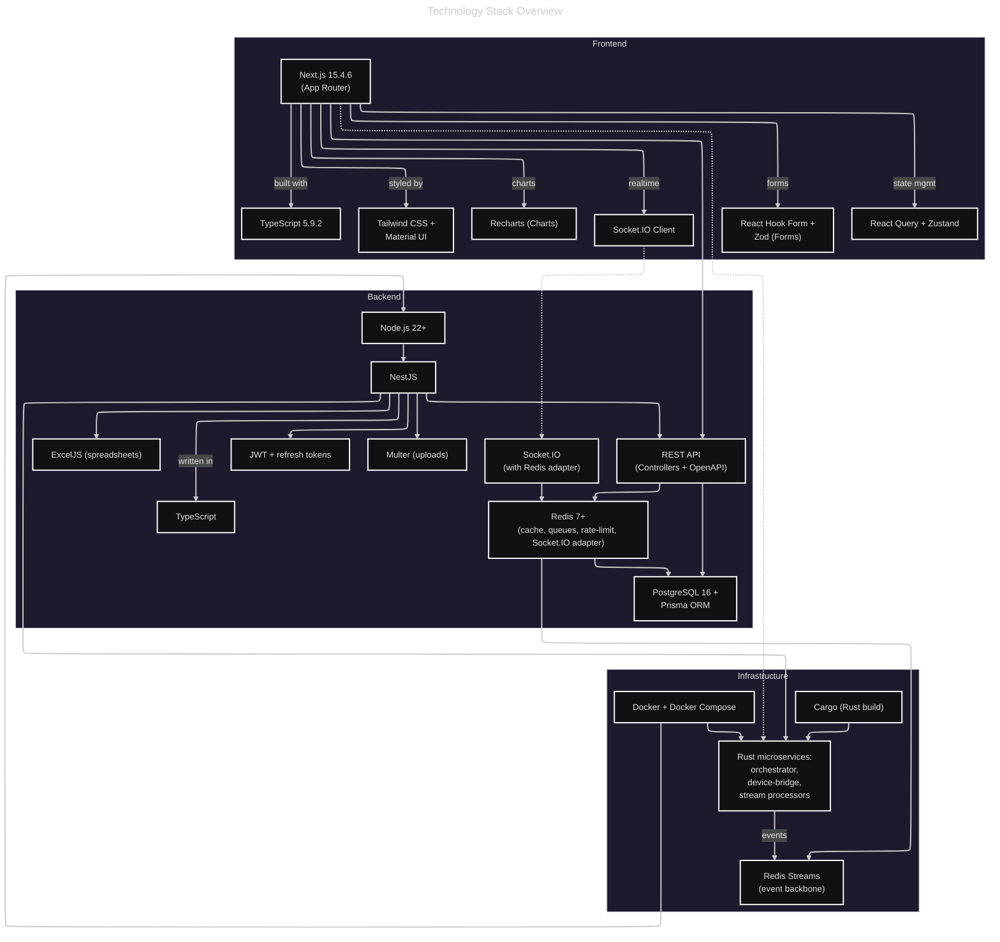

## **What you know about SWMS**

### **1. SWMS Definition & Domain**

**SWMS** = **Smart Waste Management System** ** ✅

**Core Business**: Construction & Demolition (C&D) Waste Recycling Facility Operations in KSA ✅

**Key Characteristics**:

- Multi-site operations across the Kingdom of Saudi Arabia
- Processes construction and demolition debris into recycled materials ✅
- Converts waste (concrete, wood, metal, drywall) into reusable aggregates
- Diverts 40-60% of waste from landfills ✅
- Supports circular economy and sustainable construction practices ✅

---

### **2. System Architecture (From My Memory)**



**Type**: Hybrid distributed platform ✅

- **Cloud**: Microservices on Kubernetes ✅
- **Edge**: On-site IPC/servers for resilience ✅
- **Endpoints**: Web (Next.js) + Mobile (iOS/Android) ❌

**Core Tech Stack**:

- **Backend**: Rust microservices (primary), .NET Core ✅ (secondary/legacy integration) ❌ No integration with legacy
- **Frontend**: Angular (Admin Dashboard), Next.js (customer portal) ❌
- **Database**: PostgreSQL (primary), Redis (caching/streams) ✅
- **Orchestration**: Kubernetes, Temporal.io (workflows) ✅
- **Architecture**: DDD + Event-Driven Microservices ✅

---

### **3. Trip Automation Workflow (Core Business Process)**

**SWMS Automated Trip Flow**:

```mermaid
That was so simple
```

**Critical Concept**: **Vehicle-Weight Correlation**

- Weighbridge indicators only provide weight data, **NOT vehicle identity**
- Detection devices (LPR/UHF/QR) at EVERY scale location enable trip progression
- Automatic trip state machine transitions based on device events

---

### **4. Hardware Ecosystem**

**Device Categories**:

| Category | Devices | Purpose | Integration |
|----------|---------|---------|-------------|
| **Access Control** | ZKTeco (ZKBio CVSecurity) it's devices SDK | Gate barriers | TCP/HTTP SDK |
| **Vehicle Detection** | Hikvision LPR Cameras | License plate recognition | RTSP/HTTP API |
|  | UHF RFID Readers | RFID tag detection | Serial/TCP |
|  | QR Scanners | QR code scanning | USB/Serial |
| **Weight Measurement** | Weighbridge Indicators | ZM510/ZM615 class | Serial/Modbus/TCP |
| **Site Control** | Barrier Gates | Entry/exit control | Relay/TCP |
| **Edge Computing** | Site Edge Server/IPC | Local processing, offline resilience | Windows/Linux VM |

**Network Topology**: Device protocols (TCP/HTTP/Serial/Modbus) → Edge Server → Cloud Services

---

### **5. Bounded Contexts (DDD)**

From conversation history, these are the **Core Bounded Contexts**:

1. **Trip Management** (Core Domain)
   - Automated trip lifecycle (Entry → Weigh In → Disposal → Weigh Out → Complete)
   - Trip validation and correlation
   - State machine transitions

2. **Vehicle Registry** (Supporting Domain)
   - Vehicle registration (Plate, Type, UHF Tag, Owner)
   - QR code generation
   - **NOT fleet management** (no GPS tracking, no operational monitoring)

3. **Contract Management** (Supporting Domain)
   - **Customer** (NOT "Contractor") registration
   - Basic repository: storage for vehicle registrations linked to contracts
   - **NO service agreements, fees, billing, payment processing**

4. **Device Integration** (Core Domain)
   - Device registration (plug & play)
   - Protocol adapters (TCP/HTTP/Serial/Modbus)
   - Event-driven automation
   - Device health monitoring

5. **Site Operations** (Core Domain)
   - Multi-site management
   - Zone configuration
   - Facility metrics
   - Operational monitoring

6. **Dashboard & Analytics** (Supporting Domain)
   - Real-time operational metrics
   - Trip statistics
   - Device health panels
   - Reports and exports

7. **Reporting & Compliance** (Supporting Domain)
   - Government reporting integrations
   - ETL pipelines to analytics store
   - Time-series metrics
   - Audit trails (5-year retention)

---

### **6. Key System Constraints**

**Regulatory**:

- ISO-aligned QMS
- RBAC model
- Audit trails
- Encryption in transit/at rest
- **Data residency: KSA**
- **5-year retention requirement**

**Operational**:

- Hundreds of devices per site
- ≥100 concurrent trips per site
- Multi-site deployment across KSA
- Edge computing for offline resilience
- Zero-downtime deployments
- API gateway for external integrations

**Integration**:

- Device protocols: TCP, HTTP, Serial, Modbus
- Vendor SDKs (ZKTeco, Hikvision)
- Government/SAP endpoints (secure APIs)
- Webhook ingestion/outbound
- OpenAPI contracts per service

---

### **7. What I DON'T Know (Need Clarification)**

**Business Logic**:

- Detailed pricing/billing rules (per ton, per trip, tiered?) move this to very end right before the Regulatory
- Customer onboarding workflow (approval process, KYC?)
- Vehicle allowance limits per contract (quantity, weight, time-based?)
- Waste classification taxonomy (categories, handling rules?)
- Disposal zone rules (restricted materials, safety protocols?)

**Operational Details**:

- Shift management and personnel tracking
- Equipment maintenance schedules (crushers, conveyors, etc.)
- Material inventory management (recycled products?)
- Quality control processes for recycled materials
- Environmental monitoring (dust, noise, emissions?)

**Technical Details**:

- Exact microservice boundaries and API contracts
- Event catalog (domain events, integration events)
- Temporal workflow definitions (retry policies, compensation logic)
- Database schemas (ERD details)
- Authentication/authorization model (JWT, OAuth2, RBAC roles?)

**Hardware Details**:

- Exact device models and SKUs for procurement
- Network topology diagrams (VLANs, subnets, firewall rules)
- Edge server specifications (CPU, RAM, storage, OS)
- Device placement layouts per site type
- Vendor SLAs and support contacts

---

## **My Questions for You**

Before we finalize the HLD template structure:

1. **Dual-Level Documentation Strategy**:
   - Should we use **progressive disclosure** (executive summary → detailed sections)?
   - Or create **two separate documents** (Executive HLD + Technical HLD)?
   - Or use **collapsible sections** in markdown (summary visible, details hidden)?

2. **Section Priority for Detailed Requirements**:
   - Which sections need the **most depth** for your team? (Domain Model? Hardware? Integration?)
   - Which sections can be **deferred to LLD**? (Security implementation? Deployment manifests?)

3. **Hardware Documentation Scope**:
   - Do you need **procurement-level specs** (SKUs, vendors, pricing, lead times)?
   - Or **integration-level specs** (protocols, APIs, failure modes)?
   - Or **both**?

4. **Missing Context**:
   - Do you have **existing design documents** I should reference? (ERDs, wireframes, ADRs?)
   - Any **existing codebase** I should analyze for current architecture?
   - Any **project management artifacts** (Jira epics, roadmap, sprint plans)?

5. **Documentation Tooling**:
   - Confirm: **GitHub-native Markdown** + **GitHub Pages** + **MkDocs** for PDF?
   - Any preference for diagram tooling beyond Mermaid/draw.io?
   - Do you want **OpenAI Docs Chat** integrated immediately, or defer post-v1.0?

---

**Share your detailed requirements per section, and I'll incorporate them into the final HLD template plan!**
