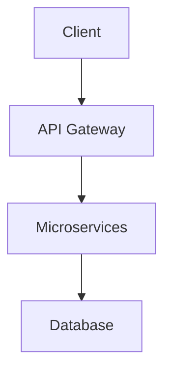

# Quick Start Guide

## ✅ Setup Complete - Ready to Use!

Your MkDocs environment is configured with:
- ✅ MkDocs 1.5.3 + Material theme
- ✅ Mermaid diagram support
- ✅ **PDF export enabled** (GTK configured)
- ✅ Python virtual environment

**Source:** GTK libraries at `C:\msys64\mingw64\bin`

---

## Start Development Server

### Easy Way (Recommended):
```powershell
.\docs-server.ps1
```

### Manual Way:
```powershell
.\venv\Scripts\Activate.ps1
mkdocs serve
```

**Access:** `http://127.0.0.1:8000`

---

## Build Site + PDF

```powershell
$env:PATH = "C:\msys64\mingw64\bin;$env:PATH"
.\venv\Scripts\Activate.ps1
mkdocs build
```

**Output:**
- Static site: `site/`
- PDF document: `site/HLD-documentation.pdf`

---

## Create HLD Content

Based on `Qu1.md` template, create these files in `docs/hld/`:

### Priority 1 (v0.9 - 10 days):
```
✅ README.md (exists)
⏳ 01-executive-summary.md
⏳ 02-system-overview.md
⏳ 04-domain-model.md
⏳ 05-architecture-overview.md
⏳ 06-microservices-catalog.md
⏳ 07-data-architecture.md
⏳ 08-integration-architecture.md
⏳ 09-hardware-specifications.md
⏳ 10-edge-computing-design.md
```

### Priority 2 (v1.0):
```
⏳ 03-business-requirements.md
⏳ 11-security-compliance.md
⏳ 12-operational-design.md
⏳ 13-deployment-cicd.md
⏳ 14-api-contracts.md
⏳ 15-event-streams.md
⏳ 16-reporting-analytics.md
⏳ 17-future-roadmap.md
⏳ 99-glossary.md
```

**Source:** Section breakdown from `Qu1.md` lines 42-66

---

## Create Diagrams

In `docs/hld/diagrams/`, create:

### Mermaid Diagrams (.mmd):
```
c4-context.mmd              # System boundary, external actors
c4-container.mmd            # Microservices, databases
deployment-topology.mmd     # Cloud, edge, on-prem zones
erd-core.mmd               # Main entities, relationships
site-flow-sequence.mmd     # Trip lifecycle, device interactions
trip-state-machine.mmd     # Temporal workflows
```

### draw.io Diagrams (.drawio):
```
hardware-layout.drawio        # Physical site topology
integration-landscape.drawio  # External systems, protocols
network-topology.drawio      # VLANs, subnets, WAN
```

**Source:** Diagram strategy from `Qu1.md` lines 78-96

---

## Example: Create First Section

```powershell
# Create executive summary
@"
# Executive Summary

## Business Context

[Your content here]

## Objectives

[Your content here]

## ROI and Timeline

[Your content here]
"@ | Out-File -FilePath "docs\hld\01-executive-summary.md" -Encoding utf8
```

---

## Example: Add Mermaid Diagram

In any markdown file:

````markdown
## System Architecture


````

**Tip:** Test diagrams at https://mermaid.live/

---

## Deploy to GitHub

### First Time Setup:
```powershell
# Initialize git (if not already)
git init
git add .
git commit -m "Initial HLD documentation"
git remote add origin https://github.com/[your-username]/[your-repo].git
git push -u origin main
```

### Deploy to GitHub Pages:
```powershell
$env:PATH = "C:\msys64\mingw64\bin;$env:PATH"
.\venv\Scripts\Activate.ps1
mkdocs gh-deploy
```

**Access:** `https://[your-username].github.io/[your-repo]/`

---

## Quick Commands

```powershell
# Start server
.\docs-server.ps1

# Build site
mkdocs build

# Build + check for errors
mkdocs build --strict

# Deploy to GitHub Pages
mkdocs gh-deploy

# Clean build directory
mkdocs build --clean

# Check MkDocs version
mkdocs --version

# List installed packages
pip list
```

---

## File Structure

```
D:\GitHub\HLD\
├── docs/
│   ├── hld/
│   │   ├── diagrams/           # Your diagrams here
│   │   ├── README.md           ✅ Exists
│   │   └── [01-17, 99].md      ⏳ Create these
│   ├── api/                    # OpenAPI specs
│   └── README.md               ✅ Exists
├── site/                       # Generated (gitignored)
│   └── HLD-documentation.pdf   # Generated on build
├── venv/                       # Python env (gitignored)
├── mkdocs.yml                  ✅ Configured
├── docs-server.ps1             ✅ Ready
└── requirements.txt            ✅ Complete
```

---

## Tips

### Live Reload:
- Save any `.md` file → browser auto-refreshes
- Server watches `docs/` directory
- Changes appear instantly

### Color Scheme (from Qu1.md):
```yaml
Cloud services: #87CEEB (sky blue)
Edge devices: #90EE90 (light green)
External systems: #FFB6C1 (light pink)
```

### Hardware Documentation Template:
See `Qu1.md` lines 100-134 for the per-device spec block format.

---

## Need Help?

- **Setup issues:** `TROUBLESHOOTING.md`
- **PDF problems:** `GTK-SETUP-WINDOWS.md`
- **Template reference:** `Qu1.md`
- **MkDocs docs:** https://www.mkdocs.org/
- **Material theme:** https://squidfunk.github.io/mkdocs-material/

---

## Next Action

Start creating content! Begin with:

```powershell
# 1. Start the server
.\docs-server.ps1

# 2. Open in browser: http://127.0.0.1:8000

# 3. Create your first file
notepad docs\hld\01-executive-summary.md

# 4. Add content and save - watch it appear in browser!
```

**Target:** Create 9 priority sections (P1) for v0.9 in 10 days per `Qu1.md` line 199-209
