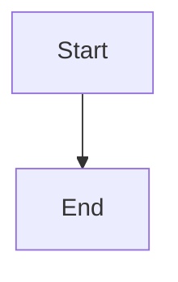

# Troubleshooting Guide

## Issue: WeasyPrint GTK Library Error on Windows

**Error Message:**
```
OSError: cannot load library 'libgobject-2.0-0': error 0x7e
```

**Cause:**
The `mkdocs-pdf-export-plugin` uses WeasyPrint, which requires GTK libraries not available on Windows.

**Solution:**
PDF export plugin is disabled in `mkdocs.yml` by default. The documentation site works perfectly without it.

**Resolution Applied:**
```yaml
plugins:
  - search
  - mermaid2
  # PDF export commented out for Windows compatibility
```

See `PDF-GENERATION.md` for alternative PDF generation methods.

---

## Warning: Files Not Found in Navigation

**Warning Message:**
```
WARNING - A relative path to 'hld/XX-filename.md' is included in the 'nav' configuration
```

**Cause:**
Navigation in `mkdocs.yml` references HLD files that haven't been created yet.

**Solution:**
This is expected. Create the files as you build the documentation following the structure in `Qu1.md`.

**Quick Fix - Create Placeholder Files:**
```powershell
.\venv\Scripts\Activate.ps1

# Create all HLD section files
$sections = @(
    "01-executive-summary",
    "02-system-overview",
    "03-business-requirements",
    "04-domain-model",
    "05-architecture-overview",
    "06-microservices-catalog",
    "07-data-architecture",
    "08-integration-architecture",
    "09-hardware-specifications",
    "10-edge-computing-design",
    "11-security-compliance",
    "12-operational-design",
    "13-deployment-cicd",
    "14-api-contracts",
    "15-event-streams",
    "16-reporting-analytics",
    "17-future-roadmap",
    "99-glossary"
)

foreach ($section in $sections) {
    $file = "docs\hld\$section.md"
    if (-not (Test-Path $file)) {
        "# $($section -replace '-', ' ' | ForEach-Object { (Get-Culture).TextInfo.ToTitleCase($_) })" | Out-File -FilePath $file -Encoding utf8
    }
}
```

---

## Server Won't Start

**Check:**
1. Virtual environment activated: `.\venv\Scripts\Activate.ps1`
2. Port 8000 not in use: `Get-NetTCPConnection -LocalPort 8000`
3. Configuration valid: `mkdocs build`

**Solutions:**
- Use different port: `mkdocs serve -a 127.0.0.1:8001`
- Kill existing process: Find PID from port check, then `Stop-Process -Id [PID]`
- Rebuild environment: Delete `venv/`, run `.\setup-docs.ps1`

---

## Mermaid Diagrams Not Rendering

**Cause:**
JavaScript not loading or syntax error in diagram.

**Solutions:**
1. Check browser console for errors (F12)
2. Validate Mermaid syntax: https://mermaid.live/
3. Ensure diagram wrapped in proper markdown fence:

````markdown

````

---

## GitHub Pages Deployment Issues

**Common Issues:**

1. **Branch not found**: Create `gh-pages` branch manually
2. **Permissions**: Enable GitHub Pages in repo settings
3. **Build fails**: Check GitHub Actions logs

**Manual Deployment:**
```powershell
mkdocs gh-deploy --clean --force
```

---

## Material Theme Not Loading

**Check:**
1. `mkdocs-material` installed: `pip list | Select-String material`
2. Theme specified in `mkdocs.yml`: `theme: name: material`

**Fix:**
```powershell
pip install --upgrade mkdocs-material
```

---

## Python Version Issues

**Requirements:**
- Python 3.8 or higher

**Check Version:**
```powershell
python --version
```

**Update Python:**
Download from: https://www.python.org/downloads/

---

## Need Help?

1. Check `README.md` for quick start guide
2. Review `PDF-GENERATION.md` for PDF options
3. See MkDocs documentation: https://www.mkdocs.org/
4. Material theme docs: https://squidfunk.github.io/mkdocs-material/
